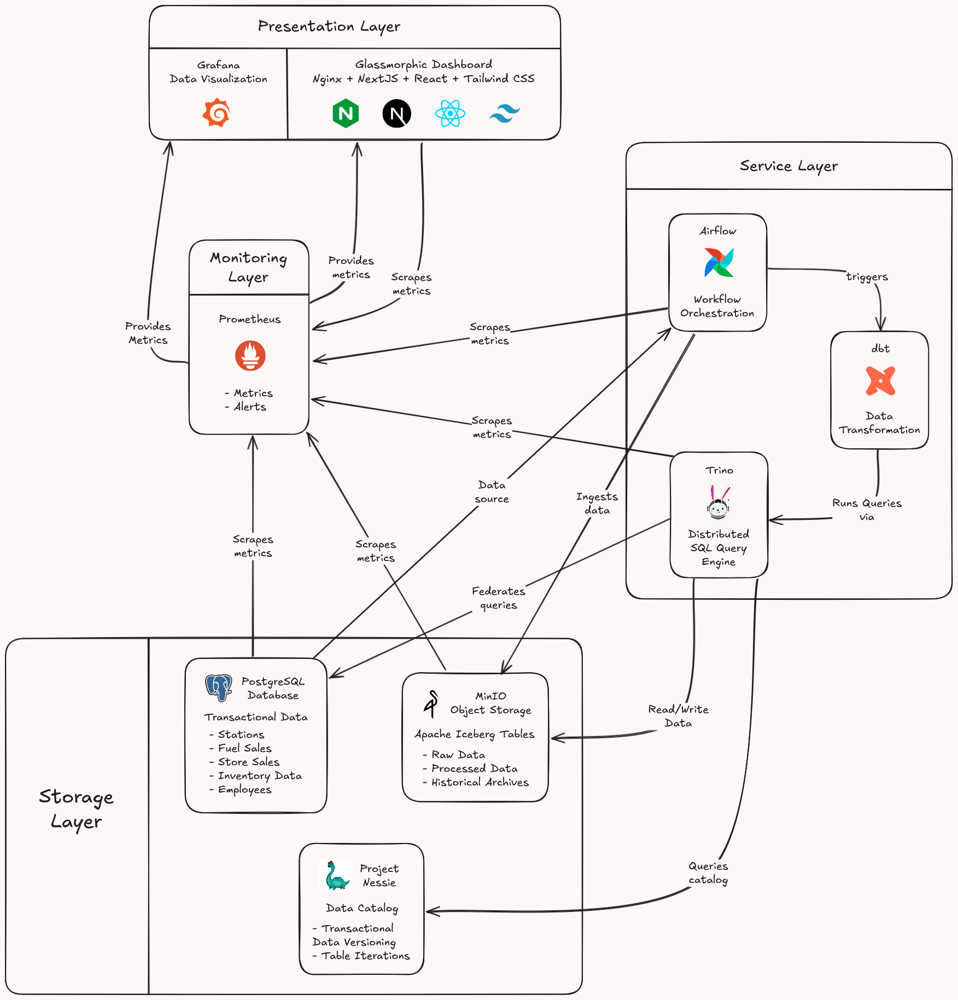

# Cagridge Data Lakehouse - Texas Gas Stations Analytics Platform

## 🏢 Overview

Cagridge operates 4 gas stations with convenience stores across Texas:

- **Houston** - Main Street
- **Dallas** - Central Avenue
- **Austin** - Downtown Congress Avenue
- **San Antonio** - Commerce Street Plaza

This project implements a complete **Modern Data Lakehouse** architecture for analytics, reporting, and data management across all locations.

## 🏗️ Architecture

### Technology Stack

| Component | Technology | Version | Port | Purpose |
| :--- | :--- | :--- | :--- | :--- |
| **Dashboard** | Nginx + HTML/CSS/JS | 1.25-alpine | 30000 | Visual Control panel |
| **Database** | PostgreSQL | 15.4-alpine | 30001 | Transactional data storage |
| **Object Storage** | MinIO | 2023-09-30 | 30002/30009 | S3-compatible data lake storage |
| **Catalog** | Project Nessie | 0.74.0 | 30003 | Git-like data versioning |
| **Query Engine** | Trino | 430 | 30004 | Distributed SQL query engine |
| **Transformation** | dbt | 1.6.2 | 30005 | Data transformation framework |
| **Orchestration** | Apache Airflow | 2.7.3 | 30006 | Workflow scheduling |
| **Monitoring** | Prometheus | 2.47.2 | 30007 | Metrics collection |
| **Visualization** | Grafana | 10.2.0 | 30008 | Analytics dashboards |
| **Metrics Exporter** | Postgres Exporter | v0.15.0 | - | PostgreSQL metrics for Prometheus |

### Architecture Diagram



## 📋 Prerequisites

- **Kubernetes Cluster** (I recommend Raspberry Pi cluster, kind, Docker Desktop, or Minikube)
- **kubectl** CLI tool installed
- **Minimum System Requirements:**
  - 8 GB RAM (16 GB recommended for multi-node cluster)
  - 4 CPU cores (8+ cores recommended)
  - 100 GB disk space (1 TB available for data storage)

**Note**: This project uses MetalLB for LoadBalancer services. The `deploy.sh` script will automatically install MetalLB v0.13.12 if not already present.

## 🚀 Quick Start

### Step 1: Start Kubernetes Cluster

Create the 6-node cluster

```bash
./manage-cluster.sh create
```

For Docker Desktop with native Kubernetes: enable Kubernetes in settings, then verify

```bash
kubectl cluster-info
```

For kind (Kubernetes in Docker) - recommended for multi-node testing:

```bash
kind create cluster --config kind-config.yaml  # kind-config.yaml provided
```

OR simple 3-node cluster:

```bash
kind create cluster -n cagridge   # (project) name = cagridge
```

For Minikube:

```bash
minikube start --cpus=4 --memory=8192 --disk-size=50g
```

**Note**: This project uses MetalLB for LoadBalancer services. The `deploy.sh` script will automatically install MetalLB v0.13.12 if not already present.

### 2. Configure Environment Variables/Secrets

**Note**: All credentials are managed through the `.env` file. Use the provided `.env.example` as a template. Best practice is to use a Secrets Manager or environment secrets in production.

### 3. Deploy All Services (Automated)

From the project root

```bash
./deploy.sh
```

### 4. Manual Deployment (Alternative)

If you prefer manual steps:

1. Create namespace

```bash
kubectl apply -f k8s/namespace.yaml
```

2. Create secrets and configmaps from .env

```bash
./create-secrets.sh
```

3. Deploy services

```bash
kubectl apply -f k8s/postgres.yaml
kubectl apply -f k8s/minio.yaml
kubectl apply -f k8s/nessie.yaml
kubectl apply -f k8s/trino.yaml
kubectl apply -f k8s/dbt.yaml
kubectl apply -f k8s/airflow.yaml
kubectl apply -f k8s/prometheus.yaml
kubectl apply -f k8s/grafana.yaml

4. Create dashboard ConfigMap and deploy

```bash
kubectl create configmap dashboard-html \
    --from-file=dashboard/index.html \
    --namespace ${NAMESPACE}
kubectl apply -f k8s/dashboard.yaml
```

### 3. Verify Deployment

```bash
kubectl get pods -n ${NAMESPACE}
kubectl get svc -n ${NAMESPACE}
kubectl get pvc -n ${NAMESPACE}
```

### 4. Access Services

All services are accessible via **MetalLB LoadBalancer IPs** (configured in `.env`):

The `deploy.sh` script automatically reads IP addresses from your `.env` file:

- **Dashboard**: http://${DASHBOARD_IP}:30000
- **PostgreSQL**: ${POSTGRES_IP}:30001
- **MinIO API**: http://${MINIO_IP}:30002
- **MinIO Console**: http://${MINIO_IP}:30009
- **Nessie API**: http://${NESSIE_IP}:30003/api/v1
- **Trino UI**: http://${TRINO_IP}:30004
- **dbt Server**: http://${DBT_IP}:30005
- **Airflow**: http://${AIRFLOW_IP}:30006
- **Prometheus**: http://${PROMETHEUS_IP}:30007
- **Grafana**: http://${GRAFANA_IP}:30008

**Note**: Edit the `.env` file to change IP addresses before deployment:

#### Alternative: Direct NodePort Access

If MetalLB isn't working, access services directly via NodePort on localhost:

```bash
# Services are accessible on localhost with NodePort
# Dashboard:   http://localhost:30000
# PostgreSQL:  localhost:30001
# MinIO API:   http://localhost:30002
# MinIO UI:    http://localhost:30009
# Nessie:      http://localhost:30003
# Trino:       http://localhost:30004
# dbt:         http://localhost:30005
# Airflow:     http://localhost:30006
# Prometheus:  http://localhost:30007
# Grafana:     http://localhost:30008
```

OR set up manual port forwarding for specific services:

```bash
kubectl port-forward -n ${NAMESPACE} svc/dashboard-service 30000:80
```

## 🗄️ Database Setup

### Initialize PostgreSQL

```bash
kubectl cp sql/init.sql ${NAMESPACE}/postgres-0:/tmp/init.sql
kubectl exec \
    --namespace ${NAMESPACE} \
    --stdin --tty \
    postgres-0 \
    -- psql -U "$POSTGRES_USER" -d "$POSTGRES_DB" -f /tmp/init.sql
```

### Connect to PostgreSQL

Using kubectl

```bash
kubectl exec \
    --namespace ${NAMESPACE} \
    --stdin --tty \
    postgres-0 \
    -- psql -U "$POSTGRES_USER" -d "$POSTGRES_DB"
```

OR

Using local psql client (via MetalLB IP from .env)

```bash
psql -h "$POSTGRES_IP" -p 30001 -U "$POSTGRES_USER" -d "$POSTGRES_DB"
```

## 📊 MinIO Setup

### Initialize MinIO Buckets

Access MinIO pod

```bash
kubectl exec -it minio-0 -n ${NAMESPACE} -- sh
```

Inside the pod, create buckets (adjust creds if changed)

```bash
mc alias set \
    local \
    http://localhost:9000 \
    "$MINIO_ROOT_USER" \
    "$MINIO_ROOT_PASSWORD"
mc mb local/lakehouse
mc mb local/warehouse
mc mb local/raw-data
mc mb local/processed-data
mc mb local/backups
```

Or use the MinIO Console at http://${MINIO_IP}:30009 (IP from .env)

## 🔧 Trino Configuration

### Create Iceberg Tables

```sql
CREATE SCHEMA iceberg.cagridge WITH (location = 's3://lakehouse/cagridge');

CREATE TABLE iceberg.cagridge.fuel_sales (
    station_id INTEGER,
    transaction_date TIMESTAMP,
    fuel_type VARCHAR,
    gallons DECIMAL(10,3),
    price_per_gallon DECIMAL(6,3),
    total_amount DECIMAL(10,2)
) WITH (
    format = 'PARQUET',
    partitioning = ARRAY['month(transaction_date)']
);
```

## 🌊 Airflow DAGs

### Create Sample DAG

```bash
kubectl cp airflow/dags/ ${NAMESPACE}/airflow-webserver-0:/opt/airflow/dags/
```

Sample DAG structure:

```python
from airflow import DAG
from airflow.operators.python import PythonOperator
from datetime import datetime, timedelta

default_args = {
    'owner': 'cagridge',
    'depends_on_past': False,
    'start_date': datetime(2024, 1, 1),
    'email_on_failure': False,
    'retries': 1,
    'retry_delay': timedelta(minutes=5),
}

dag = DAG(
    'cagridge_daily_etl',
    default_args=default_args,
    description='Daily ETL for Cagridge stations',
    schedule_interval='0 2 * * *',
    catchup=False
)

# then Define tasks...
```

## 📈 Monitoring

### Prometheus Targets

Prometheus automatically scrapes metrics from:

- PostgreSQL (port 5432)
- MinIO (port 9000)
- Trino (port 8080)
- Airflow (port 8080)
- Nessie (port 19120)

### Grafana Dashboards

1. Access Grafana at <http://localhost:30008>
2. Login: `${GF_SECURITY_ADMIN_USER}` / `${GF_SECURITY_ADMIN_PASSWORD}`
3. Pre-configured data sources:
   - Prometheus (metrics)
   - PostgreSQL (data)

## 🔐 Security Configuration

### Credentials Management

All credentials are managed via the `.env` file (Or Secret Manager / environment secrets)

1. Update .env file with new credentials

2. Recreate secrets

### Update Credentials for deployment

```bash
./create-secrets.sh
```

3. Restart affected services

```bash
kubectl rollout restart statefulset postgres -n ${NAMESPACE}
kubectl rollout restart statefulset minio -n ${NAMESPACE}
kubectl rollout restart statefulset trino -n ${NAMESPACE}
```

### Generate Strong Passwords

```bash
tr -dc 'A-Za-z0-9_-' </dev/urandom | head -c 32; echo
```

## 🧪 Testing

### Verify Services

```bash
kubectl exec \
    --namespace ${NAMESPACE} \
    --stdin --tty \
    postgres-0 \
    -- psql -U "$POSTGRES_USER" -d "$POSTGRES_DB" -f /tmp/init.sql

kubectl exec \
    --namespace ${NAMESPACE} \
    --stdin --tty \
    postgres-0 \
    -- psql -U "$POSTGRES_USER" -d "$POSTGRES_DB" -c "SELECT version();"

kubectl exec \
    --namespace ${NAMESPACE} \
    --stdin --tty \
    minio-0 \
    -- curl -sS http://localhost:9000/minio/health/live

kubectl exec \
    --namespace ${NAMESPACE} \
    --stdin --tty \
    nessie-0 \
    -- curl -sS http://localhost:19120/api/v1/config

kubectl exec \
    --namespace ${NAMESPACE} \
    --stdin --tty \
    trino-0 \
    -- curl -sS http://localhost:8080/v1/info
```

## 📦 Backup & Restore

### Backup PostgreSQL

```bash
kubectl exec \
    --namespace ${NAMESPACE} \
    postgres-0 \
    -- pg_dump -U "$POSTGRES_USER" "$POSTGRES_DB" \
    > backup.sql
```

### Restore database

```bash
kubectl exec \
    --namespace ${NAMESPACE} \
    postgres-0 \
    -- pg_dump -U "$POSTGRES_USER" "$POSTGRES_DB" \
    < backup.sql
```

### Backup MinIO

```bash
kubectl exec \
    --namespace ${NAMESPACE} \
    --stdin --tty \
    minio-0 \
    -- mc mirror local/lakehouse /backup/lakehouse
```

## 🛠️ Troubleshooting

### Pods Not Starting

```bash
kubectl get pods -n ${NAMESPACE}
kubectl logs <pod-name> -n ${NAMESPACE}
kubectl describe pod <pod-name> -n ${NAMESPACE}
```

### Persistent Volume Issues

```bash
kubectl get pvc -n ${NAMESPACE}
```

Note: This project uses dynamic PVC provisioning via the cluster's default StorageClass.

### Service Not Accessible

**For kind clusters or Windows users**:
Use NodePort access on localhost (e.g., ports 30000-30009) or set up manual port forwarding:

**For debugging individual services**:

Port-forward a specific service:

```bash
kubectl get endpoints -n ${NAMESPACE}
kubectl port-forward -n ${NAMESPACE} svc/postgres-service 30001:5432
```

## 🔄 Scaling

### Scale Deployments

Scale stateless services e.g., Dashboard. Stateful services (PostgreSQL, MinIO, Trino, Airflow, Nessie) remain at 1 replica in this setup.

```bash
kubectl scale deployment dashboard --replicas=2 -n ${NAMESPACE}
```

## 📝 Development

### Local Development

```bash
kubectl logs -f <pod-name> -n ${NAMESPACE}
kubectl exec -it <pod-name> -n ${NAMESPACE} -- /bin/bash
kubectl cp local-file.txt ${NAMESPACE}/<pod-name>:/remote-path/
kubectl cp ${NAMESPACE}/<pod-name>:/remote-file.txt ./local-file.txt
```

## 🗑️ Cleanup

### Delete All Resources

```bash
./cleanup.sh
```

## 📚 Additional Resources

Apache Iceberg Documentation - <https://iceberg.apache.org/>
Project Nessie Documentation - <https://projectnessie.org/>
Trino Documentation - <https://trino.io/docs/current/>
dbt Documentation - <https://docs.getdbt.com/>
Apache Airflow Documentation - <https://airflow.apache.org/docs/>
Kubernetes Documentation - <https://kubernetes.io/docs/>

## 👥 Team & Support

Cagridge IT Department

- Email: <it@cagridge.com>
- Support: <support@cagridge.com>

## 📄 License

Proprietary - Cagridge Gas © 2025

---

**Last Updated:** December 28, 2025
**Version:** 1.0.1
**Project:** Cagridge Data Lakehouse
**Location:** Texas (Houston, Dallas, Austin, San Antonio)
